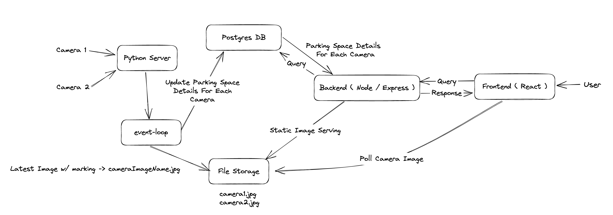

## Find My Spot! 🚗

Log in the application and find the perfect parking spot for your vehicle.

### Tech Stack:

1. **ReactJS** w/ **MapBox** for Client Side Rendering
2. **ExpressJS** w/ **PostgreSQL** DB
3. **Python** w/ **OpenCV** for detecting vacant parking spots through **Image Processing**

### Workflow Architecture:

    <em>Fig: Workflow Architecture</em>

### Result:

    <em>Fig: Find My Spot Result</em>

